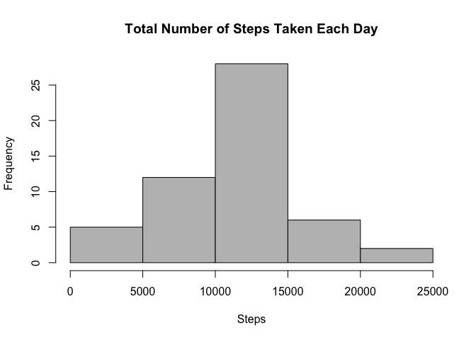
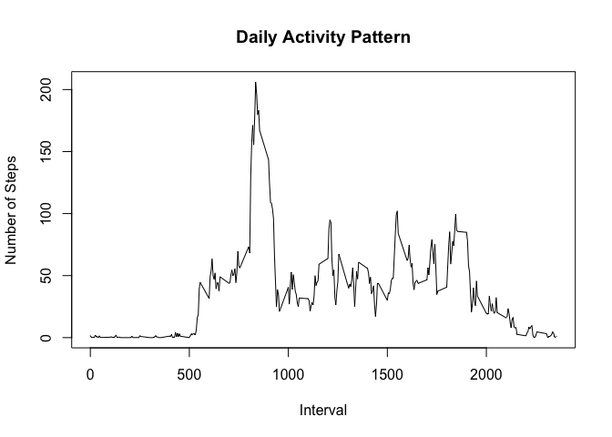
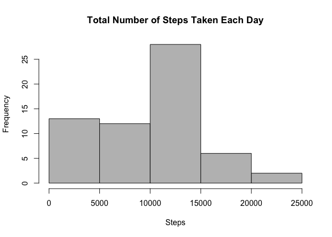
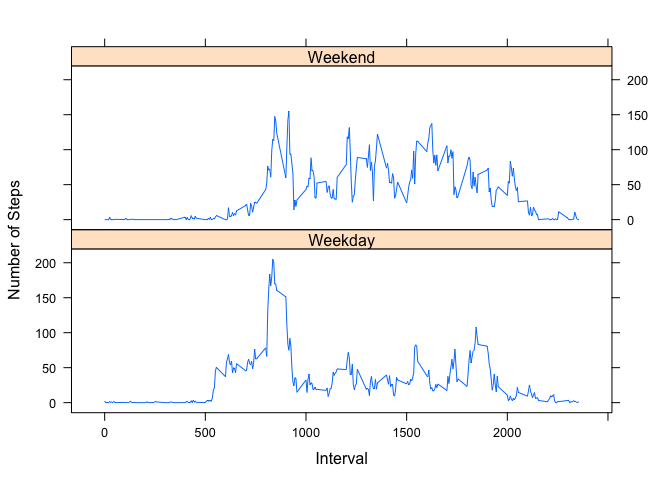

# Reproducible Research: Peer Assessment 1


## Loading and preprocessing the data

The assumption is that the user is in the same directory as _activity.csv_.


```r
library(data.table)
library(lattice)
tmp1 <- read.csv("activity.csv")
activity_table <- data.table(tmp1)
```

## What is mean total number of steps taken per day?


```r
total_steps_per_day <- activity_table[, list(steps = sum(steps)), by = 'date']

colors = c("gray", "gray", "gray", "gray", "gray")
hist(total_steps_per_day$steps, col = colors,
  main = "Total Number of Steps Taken Each Day",
  xlab = "Steps")
```

<!-- -->

Mean and Median

```r
mean_total <- mean(total_steps_per_day$steps, na.rm = TRUE)
mean_total
```

```
## [1] 10766.19
```

```r
median_total <- median(total_steps_per_day$steps, na.rm = TRUE)
median_total
```

```
## [1] 10765
```

## What is the average daily activity pattern?

```r
mean_steps <- activity_table[, list(steps = mean(steps, na.rm = TRUE)), by = 'interval']
plot(mean_steps, type="l", xlab="Interval", ylab="Number of Steps", main="Daily Activity Pattern")
```

<!-- -->

The index of the maximum over all of the intervals

```r
index_max_step <- which.max(mean_steps$steps)
index_max_step
```

```
## [1] 104
```

## Imputing missing values
Total number of missing values in the dataset

```r
num_na <- sum(is.na(activity_table$steps))
num_na
```

```
## [1] 2304
```

Using median value for a interval as value for an NA value

```r
median_steps <- activity_table[, list(steps = median(steps, na.rm = TRUE)), by = 'interval']
filled_df <- activity_table
for (row in 1:nrow(activity_table)) {
  if(is.na(activity_table$steps[row])) {
    cur_median_value <- median_steps$steps[which(median_steps$interval ==
                                           activity_table$interval[row])]
    filled_df$steps[row] <- cur_median_value
  }
}
sum(is.na(filled_df$steps))
```

```
## [1] 0
```
Histogram of new dataset

```r
new_total_steps_per_day <- filled_df[, list(steps = sum(steps)), by = 'date']

colors = c("gray", "gray", "gray", "gray", "gray")
hist(new_total_steps_per_day$steps, col = colors,
  main = "Total Number of Steps Taken Each Day",
  xlab = "Steps")
```

<!-- -->

New mean and median values using the new dataset

```r
mean_new_total <- mean(new_total_steps_per_day$steps, na.rm = TRUE)
mean_new_total
```

```
## [1] 9503.869
```

```r
median_new_total <- median(new_total_steps_per_day$steps, na.rm = TRUE)
median_new_total
```

```
## [1] 10395
```

Comparing old and new values of mean and median

```r
sprintf("Mean: Old %.1f  | New %.1f", mean_total, mean_new_total)
```

```
## [1] "Mean: Old 10766.2  | New 9503.9"
```

```r
sprintf("Mean: Old %.1f  | New %.1f", median_total, median_new_total)
```

```
## [1] "Mean: Old 10765.0  | New 10395.0"
```
By imputing the corresponding median values for an interval's missing "NA" value, we see a shift ''downwards'' from the estimation computed in the first part of this assignment

## Are there differences in activity patterns between weekdays and weekends?
Creating new column for differentiating weekdays and weekends

```r
filled_df$date <- as.Date(filled_df$date)
weekendFct <- function(x) {
  if (x == "Monday") { return("Weekday") }
  if (x == "Tuesday") { return("Weekday") }
  if (x == "Wednesday") { return("Weekday") }
  if (x == "Thursday") { return("Weekday") }
  if (x == "Friday") { return("Weekday") }
  if (x == "Saturday") { return("Weekend") }
  if (x == "Sunday") { return("Weekend") }  
}

filled_df$dayOfWeek <- factor(weekdays(filled_df$date))
filled_df$typeOfDay <- sapply(filled_df$dayOfWeek, weekendFct)
```

Panel plot for mean steps over all the intervals separated by weekend and weekday data

```r
filled_mean_steps <- aggregate(filled_df$steps, list(filled_df$interval, filled_df$typeOfDay), FUN = "mean")
xyplot(x ~ Group.1 | Group.2, data = filled_mean_steps, type = 'l', layout = c(1,2), xlab = "Interval", ylab = "Number of Steps")
```

<!-- -->
